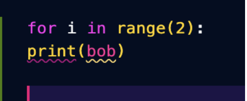
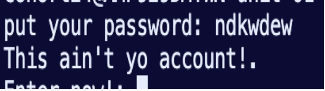

# Chef Riah's Dev Blog #2

@J3r1ah

<h2>posts below </h2>

# Intoduction

Hi my time in my second marking period of my full stack development class ive had allot of toubles and debugging was mosts definiteley the most annoying points
of that making period.

# What is debugging?

Debugging or Troubleshooting is the proccess of fixing unoticed problem or just problems in you code in general. That sounds light and easy right? lol i thought so too
because its not the idea thats hard its the fact that there are multiple different errors and different fixes for them so toubleshooting suddenly doesnt feel like a . regular task it feels like playing chess and memorizing all openings a defenses.

# Errors and Error types 

Remember when i said there were multiple different erors and error fixes yeah there is allot one of the more tame ones and pesonallythe esiest to deal with is syntax errors.

<h2>SYNTAX ERRORS</h2>

- syntax errors are the errors you get when you type out code that goes against the rules of the coding language you use in this case we use python.

<h2>EXAMPLE:</h2>

 

Another error that could be petty tricky when it comes to trouble shooting or debugging is logical errors.

<h2>LOGICAL ERRORS</h2>

Logical errors occur when you apply incorrectlogic to your program and get an unexpected result from it.

<h2>EXAMPLE:</h2>

 
 

 

One of the more inteesting ones are Runtime errors.

<h2>RUNTIME ERRORS</h2>
 
A Runtime eror is when your code stops at an eror and does not register as a syntax error. 

<h2>EXAMPLE>

 
 

 

The most self explanitory and kind of funny ones are user errors.

<h2>USER ERRORS</h2>

A user error is when the user makes a mistakes inputting or typing in the wrong character or what we call values into a pogram or terminal.

<h2>EXAMPLE:</h2>

 

so basically you typed in the wrong thing skill issue we have all been there.

ive been through all these problems and error s through my time debugging and troubleshooting and with these problrms being highlighted i end my blog here .

